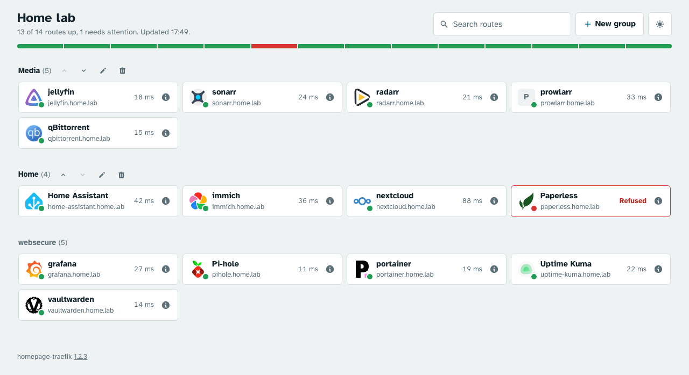

# homepage-traefik

A small homepage that lists every route your Traefik is serving, with a live status for each one.

- **Nothing to configure per service.** It reads the routers from the Traefik API, so a new service shows up within one poll.
- **Every provider.** It reads routers defined anywhere: Docker labels, the file provider (a `providers.yaml` or other dynamic config files), Kubernetes, Consul and the rest. See [Where routes come from](#where-routes-come-from).
- **Health checks.** Each route is checked from the server, and failures are explained in plain words.
- **Your layout.** Rename routes, set icons, hide the ones you don't need and drag them into groups. Everyone who opens the page sees the same layout.
- **Lightweight.** A single Node.js process with no runtime dependencies.



## Quick start

The example `docker-compose.yml` starts Traefik, the homepage and a `whoami` demo service:

```sh
mkdir config
docker compose up -d
```

Open <http://home.localhost>. You should see `home.localhost` and `whoami.localhost` listed. On Linux, if your user's UID isn't 1000, run `sudo chown 1000 config` first (see [Saved settings](#saved-settings)).

## Adding it to an existing Traefik

1. Enable the Traefik API, either with `--api.insecure=true` (serves it on port 8080 inside the Docker network) or with `--api=true` and a router for `api@internal` that the homepage can reach without authentication.
2. Run the homepage on the same Docker network as Traefik, using the pre-built image for `amd64` and `arm64`:

```yaml
services:
  homepage:
    image: ghcr.io/gregoryduckworth/homepage-traefik:main
    environment:
      TRAEFIK_API_URL: http://traefik:8080
      HOMEPAGE_TITLE: Home lab
    volumes:
      - ./config:/app/config
    labels:
      - traefik.enable=true
      - traefik.http.routers.homepage.rule=Host(`home.example.com`)
      - traefik.http.services.homepage.loadbalancer.server.port=3000
```

The `main` tag follows the latest commit. When a version is tagged on GitHub (`v1.2.3`), the image also gets `1.2.3` and `1.2` tags. Pin one of those if you'd rather choose when to upgrade.

## Where routes come from

The homepage asks Traefik which routers it's serving (`/api/http/routers` and `/api/tcp/routers`). So it lists routers from **every provider** Traefik has loaded, not just Docker labels. A router in a file-provider config shows up exactly like one from a label:

```yaml
# providers.yaml, loaded with --providers.file.filename=/etc/traefik/providers.yaml
http:
  routers:
    nas:
      rule: Host(`nas.example.com`)
      entryPoints: [websecure]
      tls: {}
      service: nas
  services:
    nas:
      loadBalancer:
        servers:
          - url: http://192.168.1.20:5000
```

This lists **nas**, linked to `https://nas.example.com`, with `nas@file` as its router name in the details panel. Routers from Kubernetes, Consul or any other provider appear the same way.

How a router is shown:

- **Name:** the router name without its `@provider` suffix (`jellyfin@docker` shows as **jellyfin**). You can rename it on the page.
- **Link:** the first `Host` in the rule, plus any `Path`/`PathPrefix`, over `https://` if the router has TLS. Links use ports 80/443. If an entry point is published on another port, set `ENTRYPOINT_PORTS` (for example `websecure:8443`).
- **Grouping:** by entry point, until you make your own groups.
- An HTTP→HTTPS redirect pair for the same host and path is listed once, as the HTTPS route.
- Routers without a `Host` (for example `HostRegexp` or path-only rules) are listed without a link.
- TCP routers are listed by name with their `HostSNI` hostname. They have no link and no health check. Their router name starts with `tcp:` (for example `tcp:postgres@docker`).
- Traefik's own `@internal` routers (API, dashboard) are left out. Disabled routers and routers with warnings are marked as such.

## Configuration

| Variable                       | Default                | Description                                                                                         |
| ------------------------------ | ---------------------- | --------------------------------------------------------------------------------------------------- |
| `TRAEFIK_API_URL`              | `http://traefik:8080`  | Base URL of the Traefik API                                                                         |
| `HOMEPAGE_TITLE`               | `Routes`               | Heading and browser tab title                                                                       |
| `POLL_INTERVAL_SECONDS`        | `30`                   | How often routes are read from Traefik (at least 5)                                                 |
| `HEALTHCHECK_INTERVAL_SECONDS` | `60`                   | How often each route is checked (at least 10)                                                       |
| `HEALTHCHECK_TIMEOUT_SECONDS`  | `10`                   | How long each health check and icon request may take (at least 1)                                   |
| `HEALTHCHECK_ADDRESS`          | (unset)                | Send health checks to this host instead of each route's hostname, for example `traefik` (see below) |
| `ENTRYPOINT_PORTS`             | (unset)                | Ports for entry points not on 80/443, for example `websecure:8443,web:8080`                         |
| `CONFIG_FILE`                  | `config/homepage.json` | Where your groups, names and icons are saved (`/app/config/homepage.json` in the image)             |
| `PORT`                         | `3000`                 | Port the homepage listens on                                                                        |
| `FRAME_ANCESTORS`              | `'self'`               | Sites allowed to show the homepage in a frame, for example `https://dash.example.com`               |

## Health checks

Each enabled route with a link is checked once per `HEALTHCHECK_INTERVAL_SECONDS` with a `HEAD` request, retried once with `GET` if that fails with a 5xx, a timeout or a reset. Checks run when Traefik is polled, so the interval is rounded up to a whole number of polls: with the defaults (`POLL_INTERVAL_SECONDS=30`, `HEALTHCHECK_INTERVAL_SECONDS=60`) each route is checked every 60 seconds, and a 45-second interval also works out at every 60 seconds. Results are only kept in memory, so after a restart routes show as **Checking** until the first checks finish, a few seconds later. A strip across the top shows every route at a glance, and the info button on each route opens a details panel. The panel explains a failure in a sentence, for example "Connected to 172.18.0.2:443, but it didn't send a response within 10 seconds".

| Status                     | Meaning                                                                                                                            |
| -------------------------- | ---------------------------------------------------------------------------------------------------------------------------------- |
| **Up**                     | Any response below 500, with its response time                                                                                     |
| **No router**              | Traefik's own `404 page not found`: the check reached a Traefik, or an entry point, that doesn't serve this route                  |
| **HTTP 5xx**               | The route answered with a server error                                                                                             |
| **Timed out**              | No response within `HEALTHCHECK_TIMEOUT_SECONDS`                                                                                   |
| **DNS failed**             | The hostname doesn't resolve from the homepage container                                                                           |
| **Refused** / **Reset**    | Nothing listening on the port / the connection closed before a response                                                            |
| **Unreachable**            | No network route to the host                                                                                                       |
| **Certificate error**      | The certificate isn't trusted, has expired or doesn't match. Self-signed certificates and private CAs aren't trusted               |
| **TLS error** / **Down**   | The TLS handshake failed (for example HTTPS on a plain HTTP port) / anything else                                                  |

**If everything times out or is refused but works in your browser:** the checks run from inside the homepage container. There, `*.localhost` resolves to the container itself, and public hostnames often resolve to an IP your router won't loop back to. Set `HEALTHCHECK_ADDRESS` to your Traefik container's name (for example `traefik`). Checks then connect straight to Traefik on the route's port, while still sending the route's hostname so Traefik picks the right router. This needs Traefik's entry points to listen on the same ports inside its container as the links use (80 and 443, or those in `ENTRYPOINT_PORTS`).

## Customising the page

- **Names and icons:** open a route's details and select **Change name or icon**. An icon is any `http://` or `https://` image address, for example from [Dashboard Icons](https://github.com/homarr-labs/dashboard-icons). Without one, the homepage uses the site's own icon (its SVG icon, `apple-touch-icon` or favicon, looked up from the server), or else the name's first letter.
- **Hiding:** select **Hide route** in its details. Hidden routes are left off the page and the status strip. **Show hidden routes** brings them back into view.
- **Groups:** select **New group**, then drag routes onto it. Reorder routes and groups by dragging them, or use the arrow buttons. You can also pick a group from the **Group** menu in a route's details, which works with a keyboard and on phones. Deleting a group sends its routes back to their entry point groups.
- Press `/` to search by name, address, service or rule. The page has light and dark themes, and updates by itself when anything changes.

Anyone who can open the homepage can change these settings. Put authentication middleware in front of it in Traefik if that matters to you.

## Saved settings

Mount a folder at `/app/config` so your settings survive upgrades:

```yaml
    volumes:
      - ./config:/app/config
```

The server keeps two files there:

| File            | What's in it                                      | Back it up?             |
| --------------- | ------------------------------------------------- | ----------------------- |
| `homepage.json` | Your groups, names, icons and hidden routes       | Yes                     |
| `icons.json`    | Icons found on your sites                         | No, it's only a cache   |

`homepage.json` is only written when you change something on the page, so it's safe to keep in git. Older versions also kept a `health.json` there; it's no longer used, so you can delete it.

The container runs as UID 1000, which must be able to write to the folder. Create it before the first start (`mkdir config`); otherwise Docker creates it owned by root. On Linux, run `sudo chown 1000 config` if your UID isn't 1000. A named volume (`homepage-config:/app/config`) works too.

You can also edit `homepage.json` by hand. Changes show up without a restart, and if the file isn't valid, the page says why and keeps the last layout:

```json
{
  "groups": [
    { "name": "Media", "routes": ["jellyfin@docker", "nas@file"] },
    { "name": "Monitoring", "routes": ["grafana@docker"] }
  ],
  "routes": {
    "jellyfin@docker": { "name": "Jellyfin", "icon": "https://cdn.jsdelivr.net/gh/homarr-labs/dashboard-icons/svg/jellyfin.svg" },
    "homepage@docker": { "hidden": true }
  }
}
```

Routes are identified by their full router name, shown as **Router** in the details panel. Entries for routers Traefik isn't serving right now are kept, and come back into place when the router returns.

### Disk writes and SD cards

The homepage is meant to run on a Raspberry Pi without wearing out its SD card. Health checks and icon lookups are network requests, and health results are only kept in memory, so the only writes are to the two files above:

| File            | When it's written                                                                                                    |
| --------------- | -------------------------------------------------------------------------------------------------------------------- |
| `homepage.json` | Only when you change something on the page                                                                           |
| `icons.json`    | When a route's icon is found or changes, and when its daily re-check finishes: at most about once a day per route    |

Each save writes a temporary file and renames it over the old one, so a power cut can't leave half a file.

Apart from one line at startup, the server only logs when something goes wrong, but while Traefik is unreachable it logs one line per poll. Docker keeps container logs on disk, so a size limit such as `logging: { driver: local, options: { max-size: 1m } }` in your compose file keeps them small.

## API

| Endpoint                        | Description                                                                                                    |
| ------------------------------- | -------------------------------------------------------------------------------------------------------------- |
| `GET /api/routes`               | Routes with their health, saved settings (`custom`) and found icon, plus your groups                           |
| `PUT /api/groups`               | Replace the groups: `{"groups": [...]}`                                                                        |
| `PUT /api/routes/<router name>` | Set any of `{"name": "...", "icon": "...", "hidden": true}`. Empty or `false` clears; omitted fields are kept |
| `GET /api/icons/<router name>`  | The icon found on the route's site                                                                             |
| `GET /api/events`               | Server-sent events, one message whenever anything on the page changes                                          |
| `GET /healthz`                  | Liveness check                                                                                                 |

`PUT` bodies are sent as `application/json`.

## Development

Requires Node.js 22 or newer.

```sh
TRAEFIK_API_URL=http://localhost:8080 npm run dev
npm test                                   # unit tests, nothing to install
npm run test:coverage                      # the same, reporting which lines they reach
npm install && npx playwright install chromium
npm run test:e2e                           # browser tests against a fake Traefik API
npm run lint                               # ESLint, as CI runs it
```

Playwright and ESLint are development dependencies only; the image doesn't include them.
